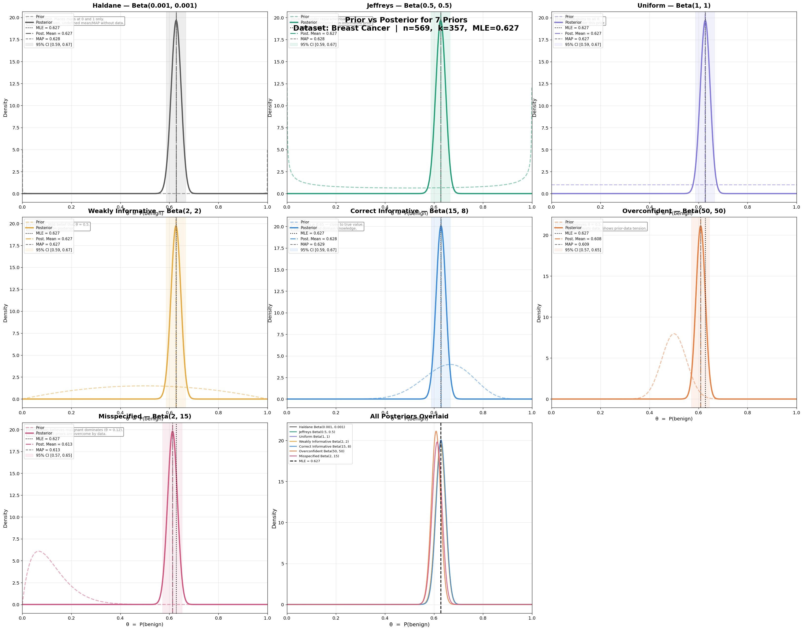
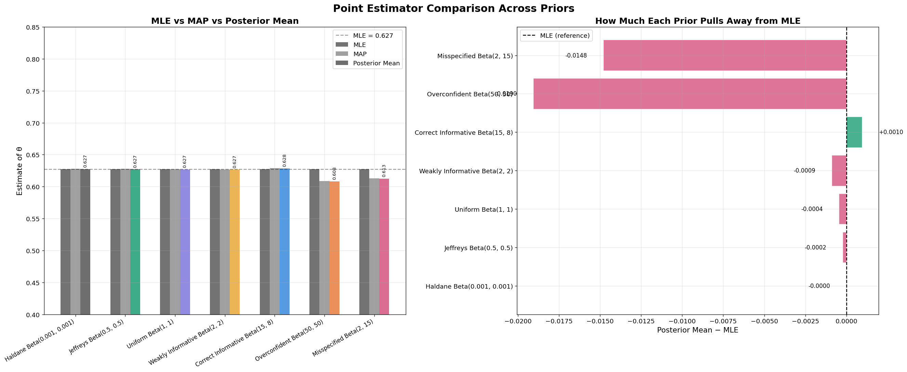
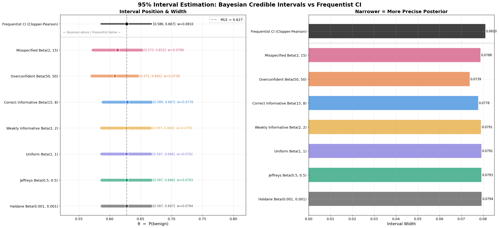
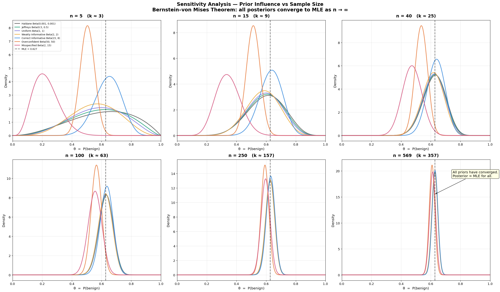
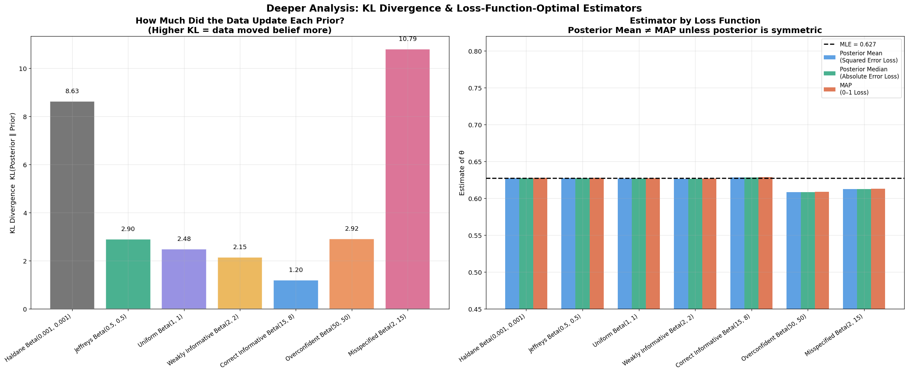

# Effect of Prior Choice on Bayesian Estimation

### A Sensitivity Analysis using the Beta-Binomial Conjugate Model

A Bayesian sensitivity analysis investigating how prior choice affects posterior inference, point estimates, credible intervals, predictive probabilities, and convergence as the amount of observed data increases.



## Overview

In Bayesian inference, the prior distribution represents beliefs about an unknown parameter before observing data. Once data are observed, the prior is combined with the likelihood through Bayes' theorem to obtain the posterior distribution.

This raises a natural question:

> **How much do our inferential conclusions depend on the prior we choose?**

This project studies that question using the **Beta-Binomial conjugate model**. Seven Beta priors are considered, ranging from non-informative and weakly informative priors to strongly informative, overconfident, and deliberately misspecified priors.

For each prior, the analysis compares:

- Prior and posterior distributions
- Posterior mean, median, and MAP estimates
- 95% Bayesian credible intervals
- Sensitivity to sample size
- Estimators under different loss functions
- Posterior predictive probabilities

## Statistical Model

Let

$$
X_1, X_2, \ldots, X_n \overset{iid}{\sim} \text{Bernoulli}(\theta),
$$

where $\theta$ is the probability of a benign diagnosis.

If $k$ of the $n$ observations are benign, the likelihood is

$$
L(\theta \mid D) \propto \theta^k(1-\theta)^{n-k}.
$$

Using a Beta prior,

$$
\theta \sim \text{Beta}(\alpha,\beta),
$$

gives the conjugate posterior

$$
\theta \mid D \sim
\text{Beta}(\alpha+k,\beta+n-k).
$$

The closed-form posterior allows the effect of different prior assumptions to be studied without requiring numerical posterior approximation.

## Dataset

The analysis uses the **UCI Breast Cancer Wisconsin (Diagnostic) dataset**, accessed through `sklearn.datasets`.

Only the binary diagnostic label is used. The objective is **not classification**, but estimation of the marginal probability

$$
\theta = P(\text{benign}).
$$

The dataset contains:

| Quantity | Value |
|---|---:|
| Total observations | 569 |
| Benign cases | 357 |
| Malignant cases | 212 |
| MLE $\hat{\theta}=k/n$ | 0.6274 |

## Prior Specifications

Seven priors from the Beta family are considered:

| Prior | Parameters | Interpretation |
|---|---|---|
| Haldane | Beta(0.001, 0.001) | Nearly data-driven / improper limiting prior |
| Jeffreys | Beta(0.5, 0.5) | Principled non-informative prior |
| Uniform | Beta(1, 1) | Equal density over $\theta$ |
| Weakly Informative | Beta(2, 2) | Mild preference for central values |
| Correct Informative | Beta(15, 8) | Prior mean close to the observed proportion |
| Overconfident | Beta(50, 50) | Strong prior belief around 0.5 |
| Misspecified | Beta(2, 15) | Deliberately incorrect prior belief |

These priors allow both **prior location** and **prior strength** to be varied, making it possible to study how different forms of prior information affect posterior inference.

## Experiments and Results

### 1. Prior vs. Posterior Distributions


The prior and posterior distributions are compared for all seven prior specifications.

With the full dataset of 569 observations, the Haldane, Jeffreys, Uniform, and weakly informative priors produce very similar posterior distributions. The likelihood dominates these relatively weak priors.

The overconfident and misspecified priors retain more visible influence, shifting the posterior away from the MLE.

### 2. Point Estimator Comparison



Three Bayesian point estimators are compared:

- **Posterior mean** — optimal under squared-error loss
- **Posterior median** — optimal under absolute-error loss
- **MAP** — posterior mode

For the full dataset, the three estimates are very similar because the posterior distributions are approximately symmetric and unimodal.

The overconfident and misspecified priors produce the largest deviations from the MLE, while weak and non-informative priors remain close to it.

### 3. Interval Estimation



The 95% Bayesian credible intervals under each prior are compared with the frequentist **Clopper-Pearson confidence interval**.

The non-informative priors produce credible intervals numerically close to the frequentist interval. Strong or misspecified priors shift the interval according to the remaining influence of the prior.

The comparison also highlights the conceptual distinction between Bayesian credible intervals and frequentist confidence intervals.

### 4. Sensitivity to Sample Size



Prior sensitivity changes substantially with the amount of available data.

At small sample sizes, the posterior distributions are broad and strongly influenced by the choice of prior. As the sample size increases, the likelihood becomes increasingly dominant and the different posteriors converge around the MLE.

By $n=569$, the posterior distributions are tightly concentrated and much less sensitive to prior choice.

This illustrates the central practical result of the project:

> **Prior choice matters most when data are scarce.**

### 5. Loss Functions and Prior Influence



The analysis also examines the relationship between prior influence and Bayesian estimators under different loss functions.

At the full sample size, posterior mean, median, and MAP are nearly identical because the posterior distributions are approximately symmetric. Differences between these estimators become more relevant for small samples or strongly skewed posteriors.

## Posterior Predictive Inference

For the Beta-Binomial model, the posterior predictive probability that the next observation is benign is equal to the posterior mean:

```math
P(X_{\mathrm{new}} = 1 \mid D)
=
\mathbb{E}[\theta \mid D]
=
\frac{\alpha + k}{\alpha + \beta + n}
```

Thus, the posterior predictive probability is determined by the posterior mean.

For weak and non-informative priors, this prediction is very close to the MLE plug-in estimate. Strongly informative or misspecified priors retain some influence on the prediction.
## Key Findings

- **Prior choice is most consequential when the sample size is small.**
- As the amount of data increases, the likelihood increasingly dominates the prior.
- Non-informative and weakly informative priors produce very similar results with the full dataset.
- Strong priors can retain noticeable influence even after observing substantial amounts of data.
- An overconfident prior can meaningfully shift posterior inference even when its prior mean is not extremely far from the data.
- Misspecified priors are progressively corrected by data, but their influence can persist.
- Posterior mean, median, and MAP become nearly identical when the posterior is approximately symmetric and concentrated.
- Bayesian credible intervals under non-informative priors are numerically close to the corresponding frequentist confidence interval in this analysis.
- Informative priors can improve precision when well calibrated, but can introduce persistent bias when incorrect.

## Why the Beta-Binomial Model?

The Beta-Binomial model provides a convenient setting for studying prior sensitivity because the Beta family is conjugate to the Binomial likelihood.

The update

$$
\text{Beta}(\alpha,\beta)
\longrightarrow
\text{Beta}(\alpha+k,\beta+n-k)
$$

is available analytically.

This allows the project to focus directly on the statistical consequences of prior specification rather than numerical methods for approximating the posterior.

## Repository Structure

```text
bayesian-prior-sensitivity/
│
├── figures/
│   ├── fig1_prior_vs_posterior.png
│   ├── fig2_point_estimators.png
│   ├── fig3_interval_estimation.png
│   ├── fig4_sensitivity.png
│   └── fig5_kl_and_loss.png
│
├── bayesian_prior_sensitivity.ipynb
├── README.md
├── requirements.txt
└── .gitignore
```

The split versions of Figures 1 and 4 are retained in `figures/`, while the combined figures are used in this README.

## Requirements

The project uses:

- NumPy
- SciPy
- Pandas
- Matplotlib
- scikit-learn

Install the dependencies with:

```bash
pip install -r requirements.txt
```

## Team Members

- **Salaj Bansal**
- **Anmol Jain**
- **Nidarsana M**

Course project for **MA 302**, IIT Indore under the guidance of **Dr. Mohd. Arshad**


The project combines analytical Bayesian inference with computational visualization to study how prior specification, prior strength, and sample size affect statistical conclusions.
